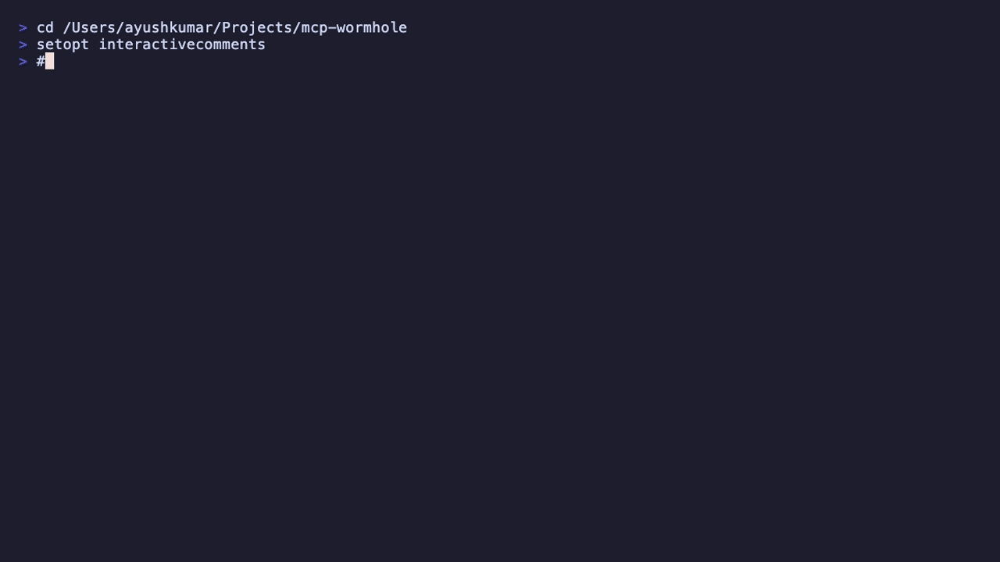

<div align="center">

# mcp-wormhole

**Open-source MCP servers that connect AI agents to the tools you already use.**

[](https://ayush7614.github.io/mcp-wormhole/)
[](https://www.npmjs.com/package/@mcp-wormhole/asana)
[](https://www.npmjs.com/package/@mcp-wormhole/asana)
[](https://www.npmjs.com/package/@mcp-wormhole/vercel)
[](https://www.npmjs.com/package/@mcp-wormhole/vercel)
[](LICENSE)
[](https://modelcontextprotocol.io)

[Documentation](https://ayush7614.github.io/mcp-wormhole/) · [Blog](https://ayush7614.github.io/mcp-wormhole/#/blog) · [Contributing](./CONTRIBUTING.md) · [GitHub](https://github.com/Ayush7614/mcp-wormhole)



</div>

---

## What is this?

**mcp-wormhole** is a monorepo of [Model Context Protocol (MCP)](https://modelcontextprotocol.io) servers — one package per integration. Each server wraps a third-party vendor API so AI clients (Cursor, Claude Desktop, VS Code Copilot, Windsurf, and 16 others) can read and act on your tools through natural language.

No new backends. No proprietary proxies. Just stdio MCP servers published to npm.

```
You  →  AI Client (Cursor, Claude, …)  →  MCP Server (npx)  →  Vendor API (Asana, Slack, …)
```

**Owner:** [@Ayush7614](https://github.com/Ayush7614)

---

## Table of contents

- [Quick start](#quick-start)
- [Available servers](#available-servers)
- [Connect your client](#connect-your-client)
- [Repository structure](#repository-structure)
- [Development](#development)
- [Adding a new server](#adding-a-new-server)
- [Publishing to npm](#publishing-to-npm)
- [Guidelines](#guidelines)
- [License](#license)

---

## Quick start

### Use a published server (no clone required)

Add this to your MCP client config (Cursor: `~/.cursor/mcp.json`, Claude Desktop: `claude_desktop_config.json`, VS Code: `.vscode/mcp.json`):

```json
{
  "mcpServers": {
    "asana": {
      "command": "npx",
      "args": ["-y", "@mcp-wormhole/asana"],
      "env": {
        "ASANA_ACCESS_TOKEN": "your_token_here"
      }
    },
    "vercel": {
      "command": "npx",
      "args": ["-y", "@mcp-wormhole/vercel"],
      "env": {
        "VERCEL_TOKEN": "your_token_here"
      }
    }
  }
}
```

For team-scoped Vercel projects, add `"VERCEL_TEAM_ID": "team_…"` to the `vercel` env block.

Restart your client, then ask: *"List my open Asana tasks"* or *"List my Vercel projects"*.

**Published on npm:** [`@mcp-wormhole/asana`](https://www.npmjs.com/package/@mcp-wormhole/asana) (0.2.0 · 66 tools · 18 prompts) · [`@mcp-wormhole/vercel`](https://www.npmjs.com/package/@mcp-wormhole/vercel) (0.2.0 · 18 tools · 8 prompts)

**Get tokens:** [Asana developer console](https://app.asana.com/0/my-apps) · [Vercel account tokens](https://vercel.com/account/tokens)

**Server guides:** [Asana MCP](https://ayush7614.github.io/mcp-wormhole/#/servers/asana/guide) · [Vercel MCP](https://ayush7614.github.io/mcp-wormhole/#/servers/vercel/guide) · [All integrations](https://ayush7614.github.io/mcp-wormhole/#/integrations)

### Clone for development

```bash
git clone https://github.com/Ayush7614/mcp-wormhole.git
cd mcp-wormhole
pnpm install
pnpm build
```

---

## Available servers

**Browse all:** [Asana](https://ayush7614.github.io/mcp-wormhole/#/servers/asana) · [Vercel](https://ayush7614.github.io/mcp-wormhole/#/servers/vercel) · [Slack](https://ayush7614.github.io/mcp-wormhole/#/servers/slack) · [Sentry](https://ayush7614.github.io/mcp-wormhole/#/servers/sentry) · [Google Calendar](https://ayush7614.github.io/mcp-wormhole/#/servers/google-calendar) · [Airtable](https://ayush7614.github.io/mcp-wormhole/#/servers/airtable) · [Stripe](https://ayush7614.github.io/mcp-wormhole/#/servers/stripe) · [Cloudflare](https://ayush7614.github.io/mcp-wormhole/#/servers/cloudflare) · [GitHub Actions](https://ayush7614.github.io/mcp-wormhole/#/servers/github-actions) · [PagerDuty](https://ayush7614.github.io/mcp-wormhole/#/servers/pagerduty) · [Linear](https://ayush7614.github.io/mcp-wormhole/#/servers/linear)

| Server | npm package | Status | Auth | Tools |
|--------|-------------|--------|------|-------|
| **Asana** | [`@mcp-wormhole/asana`](https://www.npmjs.com/package/@mcp-wormhole/asana) | **Available** | PAT | 66 tools · 18 prompts · resources |
| **Vercel** | [`@mcp-wormhole/vercel`](https://www.npmjs.com/package/@mcp-wormhole/vercel) | **Available** | API token | 18 tools · 8 prompts · resources |
| Slack | `@mcp-wormhole/slack` | Planned | Bot token | — |
| Sentry | `@mcp-wormhole/sentry` | Planned | Auth token | — |
| Google Calendar | `@mcp-wormhole/google-calendar` | Planned | OAuth | — |
| Airtable | `@mcp-wormhole/airtable` | Planned | PAT | — |
| Stripe | `@mcp-wormhole/stripe` | Planned | Secret key | — |
| Cloudflare | `@mcp-wormhole/cloudflare` | Planned | API token | — |
| GitHub Actions | `@mcp-wormhole/github-actions` | Planned | PAT | — |
| PagerDuty | `@mcp-wormhole/pagerduty` | Planned | API key | — |
| Linear | `@mcp-wormhole/linear` | Planned | API key | — |

> Each server calls the **vendor's existing REST API** — we don't host new backends.

---

## Connect your client

Step-by-step guides with copy-paste configs for **20 AI clients**:

| Client | Asana | Vercel |
|--------|-------|--------|
| Cursor | [Cursor + Asana](https://ayush7614.github.io/mcp-wormhole/#/guides/cursor/asana) | [Cursor + Vercel](https://ayush7614.github.io/mcp-wormhole/#/guides/cursor/vercel) |
| VS Code | [VS Code + Asana](https://ayush7614.github.io/mcp-wormhole/#/guides/vscode/asana) | [VS Code + Vercel](https://ayush7614.github.io/mcp-wormhole/#/guides/vscode/vercel) |
| Claude Desktop | [Claude + Asana](https://ayush7614.github.io/mcp-wormhole/#/guides/claude-desktop/asana) | [Claude + Vercel](https://ayush7614.github.io/mcp-wormhole/#/guides/claude-desktop/vercel) |
| Claude Code | [Claude Code + Asana](https://ayush7614.github.io/mcp-wormhole/#/guides/claude-code/asana) | [Claude Code + Vercel](https://ayush7614.github.io/mcp-wormhole/#/guides/claude-code/vercel) |
| …and 16 more | [All integrations](https://ayush7614.github.io/mcp-wormhole/#/integrations) | same page — pick Vercel server |

Full server walkthroughs:

- [Asana MCP server guide](https://ayush7614.github.io/mcp-wormhole/#/servers/asana/guide)
- [Vercel MCP server guide](https://ayush7614.github.io/mcp-wormhole/#/servers/vercel/guide)

---

## Repository structure

```
mcp-wormhole/
├── packages/
│   ├── asana/              # @mcp-wormhole/asana — live on npm
│   ├── vercel/             # @mcp-wormhole/vercel
│   ├── _template/          # Copy this to start a new server
│   ├── slack/              # planned
│   └── …
├── site/                   # Docs site (Vite + React, GitHub Pages)
│   ├── src/data/           # Servers, integrations, guides, blog
│   └── public/demo/        # Verification GIFs
├── package.json            # pnpm workspace root
├── pnpm-workspace.yaml
├── CONTRIBUTING.md
└── README.md
```

Each package is a standalone MCP server with its own `package.json`, tools, verify script, and README.

---

## Development

```bash
# Install all workspace dependencies
pnpm install

# Build everything
pnpm build

# Build one package
pnpm --filter @mcp-wormhole/asana build
pnpm --filter @mcp-wormhole/vercel build

# Verify Asana server against real API
cd packages/asana
cp .env.example .env   # add ASANA_ACCESS_TOKEN
pnpm verify

# Verify Vercel server against real API
cd ../vercel
cp .env.example .env   # add VERCEL_TOKEN
pnpm verify

# Run docs site locally
cd site && npm run dev
# → http://localhost:5173
```

---

## Adding a new server

1. **Copy** `packages/_template` → `packages/<name>`
2. **Implement** tools against the vendor's official API (Zod validation, MCP SDK)
3. **Document** env vars in README + `.env.example`
4. **Add** entry in `site/src/data/servers.ts` for the docs catalog
5. **Open a PR** — one server per PR

See [CONTRIBUTING.md](./CONTRIBUTING.md) for the full checklist, tool naming conventions, and publishing workflow.

---

## Publishing to npm

Packages publish under the [`@mcp-wormhole`](https://www.npmjs.com/org/mcp-wormhole) npm org.

| Package | Latest | npm |
|---------|--------|-----|
| Asana | **0.2.0** | [`@mcp-wormhole/asana`](https://www.npmjs.com/package/@mcp-wormhole/asana) |
| Vercel | **0.2.0** | [`@mcp-wormhole/vercel`](https://www.npmjs.com/package/@mcp-wormhole/vercel) |

```bash
pnpm --filter @mcp-wormhole/asana build
cd packages/asana
npm publish --access public --otp=YOUR_CODE
```

Or use **GitHub Actions → Publish npm packages → Run workflow** (requires `NPM_TOKEN` secret).

Details: [CONTRIBUTING.md § Publishing](./CONTRIBUTING.md#publishing)

---

## Guidelines

### For contributors

| Rule | Detail |
|------|--------|
| **One server per PR** | Keep reviews focused |
| **Vendor API only** | No scraping, no unofficial endpoints |
| **Read tools first** | `list_`, `get_`, `search_` before `create_`, `update_`, `delete_` |
| **Zod everywhere** | Validate all tool inputs |
| **No secrets** | Never commit tokens; use `.env.example` |
| **Verify script** | Hit the real API — no mocks in `pnpm verify` |
| **Update docs** | Add server to `site/src/data/servers.ts` + root README table |

### For users

| Rule | Detail |
|------|--------|
| **Keep tokens local** | MCP config env vars stay on your machine |
| **Restart after config** | MCP clients load servers at startup |
| **Use npx** | No repo clone needed for published packages |
| **Report issues** | [GitHub Issues](https://github.com/Ayush7614/mcp-wormhole/issues) |

### Stack

- **Runtime:** Node.js 18+
- **Language:** TypeScript
- **MCP SDK:** `@modelcontextprotocol/sdk`
- **Validation:** Zod
- **Build:** tsup
- **Transport:** stdio (local process via npx)

---

## Blog

Tutorials and release notes on the docs site:

- [Introducing mcp-wormhole](https://ayush7614.github.io/mcp-wormhole/#/blog/introducing-mcp-wormhole)
- [Connect Asana to Cursor in 5 minutes](https://ayush7614.github.io/mcp-wormhole/#/blog/connect-asana-to-cursor)
- [Connect Vercel to Cursor in 5 minutes](https://ayush7614.github.io/mcp-wormhole/#/blog/connect-vercel-to-cursor)
- [Building your first MCP server](https://ayush7614.github.io/mcp-wormhole/#/blog/building-an-mcp-server)
- [Inside @mcp-wormhole/asana](https://ayush7614.github.io/mcp-wormhole/#/blog/inside-asana-mcp-server)
- [Inside @mcp-wormhole/vercel](https://ayush7614.github.io/mcp-wormhole/#/blog/inside-vercel-mcp-server)

---

## License

MIT — see [LICENSE](./LICENSE).

---

<div align="center">

Built by [@Ayush7614](https://github.com/Ayush7614)

</div>
